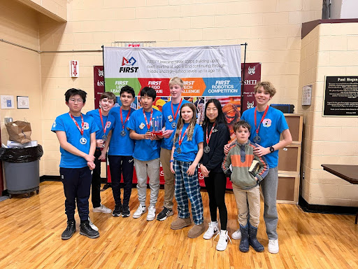
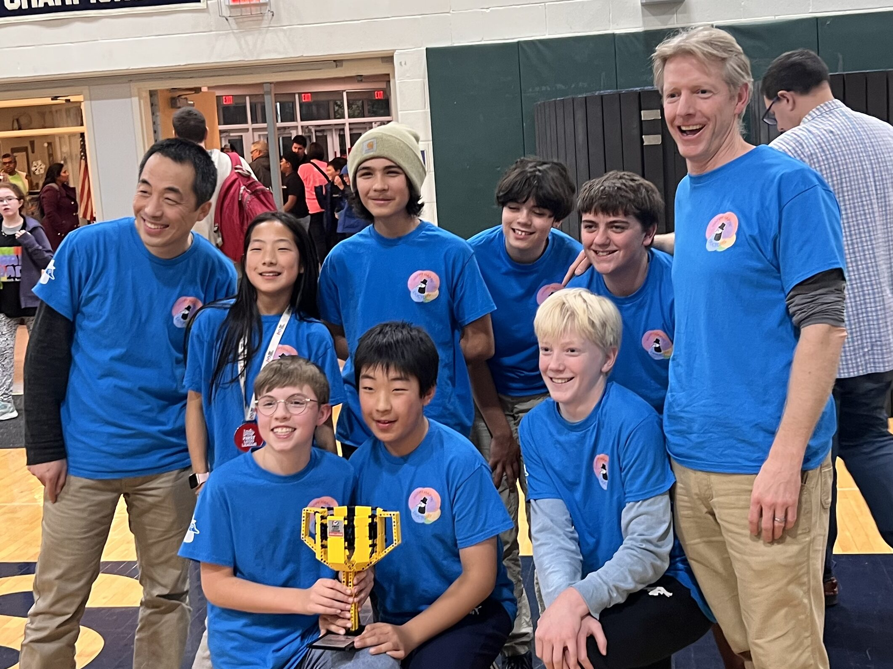
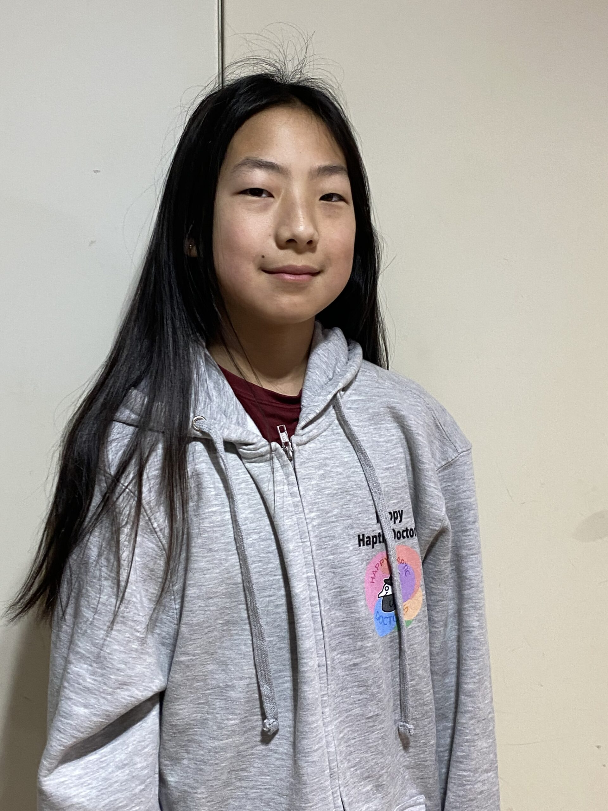
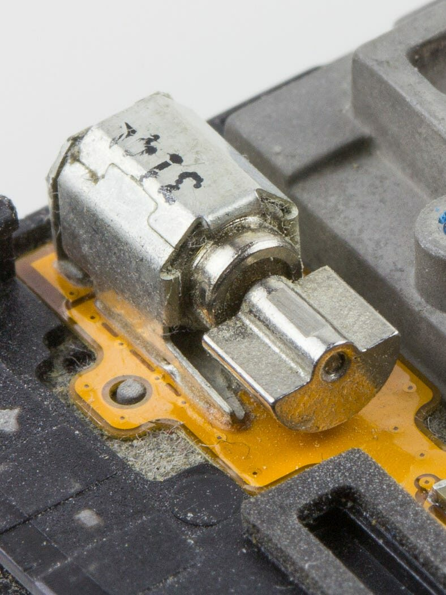
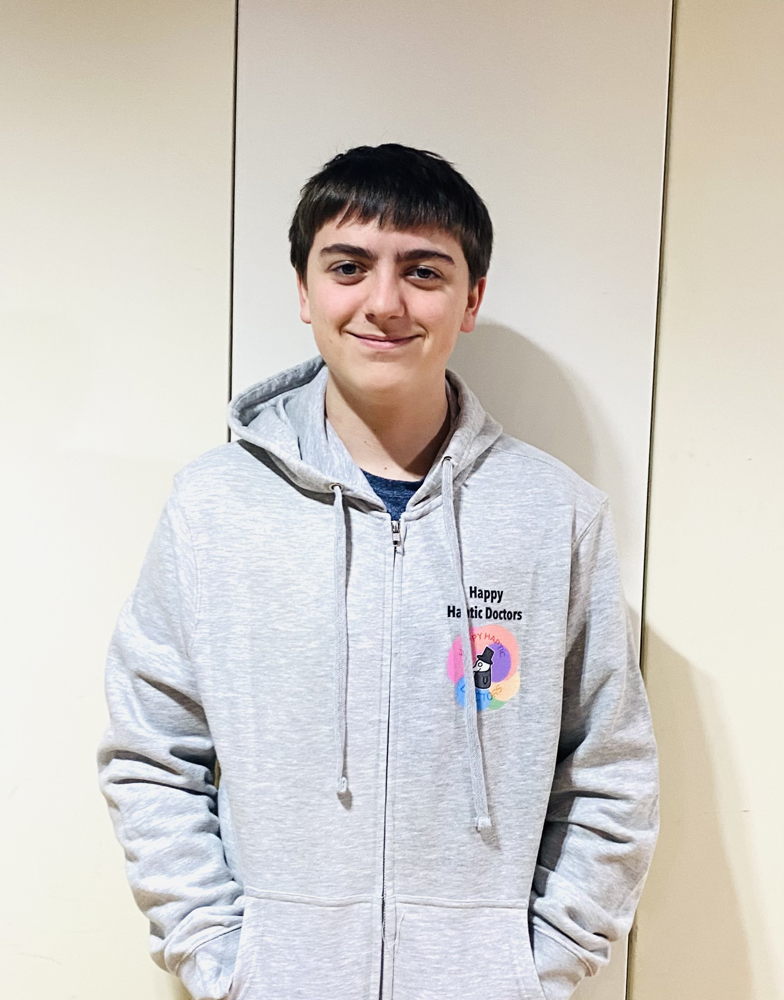
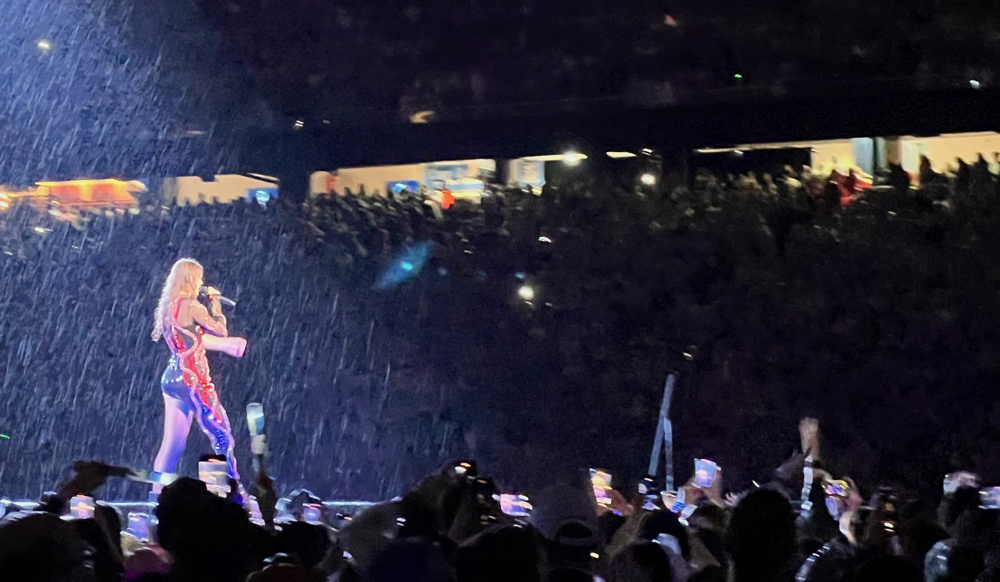

# Homepage - HapLink

We are team 26532, Happy Haptic Doctors - a robotics team competing in the First Tech Challenge 2024-2025.

Last year, we competed in the First Lego League, and attended 
the 2023-2024 Worlds Competetion.

---

## Navigation

- [Home](index.md) - [Our Team](our-team/index.md) - [Robot Design](happy-haptic-doctors-robot-design/index.md) - [2023 FLL](2023/2023/FLL2023.md) - [2024 Worlds](2024-worlds/index.md) - [2024 Highlights](2024/index.md) - [Donate](donate/index.html)

---

## Hero Section

**HapLink**

We are a small robotics team in the Upper Valley competing in a First Tech Challenge Robotics competition. HapLink is the name for our Innovation Project.

[Learn More](2024-worlds/index.md)

---

## Our Team

### 2023-24 Members:
- Kastner Anderson
- Charlie Devlin
- Grayson Lyall
- Owen Osterberg
- B Swenson
- Andy Zhang
- Ella Zhang

### 2024/25 Members:
- Kastner Anderson
- Elizabeth Anderson
- Jacob Hannan
- Grayson Lyall
- Owen Osterberg
- Alan Zhang
- Andy Zhang
- Ella Zhang

### Coaches:
- Erich Osterberg
- Yu Zhang

[More About Us](our-team/index.html)

---
### Please consider helping us with a donation.

[Donate Here](donate/index.html)

---

## Innovation Project

### Haptic Products

Here at HapLink, we make a user-friendly method for people to experience the feeling of actually being at a concert or a live sporting event from home through the use of haptic sensors, lights, and sound in easy-to-use products that will blow your mind.

---

## Products

### Haptic Hoodie

Our Haptic Hoodie allows you to experience everything a Haptic Vest can experience but on the go! It doesn’t matter where you are, all you need to do is put on the Haptic Hoodie and you’re good to go!

---

### Haptics Explained

Haptics are the use of technology to stimulate the senses of touch and motion. In our case, we are using haptics to stimulate the feeling of really being at a sporting event or concert live with the use of haptic sensors.

---

### Haptic Vest

Our Haptic Vest is cheap, easy to use, and can connect with other Haptic products. This is our most basic product that allows you to experience live concerts, live sporting events, and more all from the comfort of your home.

---

## Why You Should Buy

We have noticed a big problem around entertainment and sports media. Sports and music concerts are way too expensive. The average Taylor Swift concert ticket is a whopping $1011. On the other hand, sports tickets cost more money than most of us can fathom.

Why spend those ridiculous prices for one experience when you can spend way less money for many, many more experiences? Not only do our products make you feel like you are there in person, but you can also experience these amazing events with your friends and family because of our Haptic Linking system.

---

## Sporting Events

Watching sports on TV is fun, but it is much less of an experience than going to a real game. Our haptic suits can connect with live players' heartbeats at live games and sporting events.

---

## Concerts

Another mode of our haptic suits is to be sound reactive. This means you will be able to feel the music without having to have speakers that are bigger than you are!

---

## Recent Posts

- [Innovation Presentation](2024/04/26/innovation-presentation/index.md) - *April 26, 2024* by Julian Devlin
- [First Match!](2024/04/24/first-match/index.html) - *April 24, 2024* by Julian Devlin
- [Long Day](2024/04/20/long-day/index.md) - *April 20, 2024* by Julian Devlin

---

## Footer

**HapLink**

Copyright © 2023